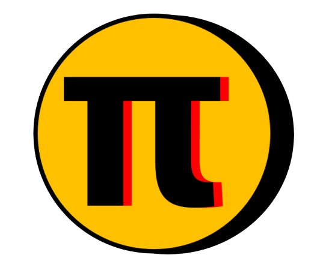
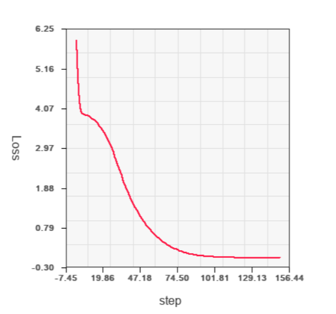
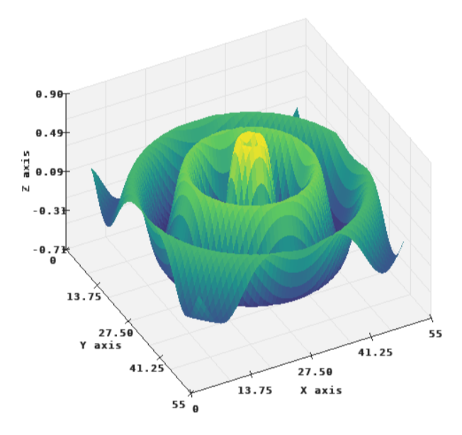
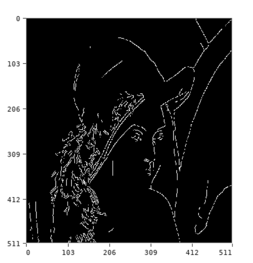
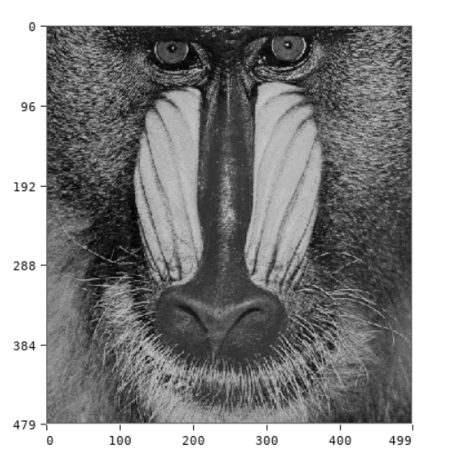

<p align="center">
  <a href="https://pi-lang.netlify.app/">
    
  </a>
</p>

<h1 align="center">Pilang</h1>

<p align="center">
  A lightweight, embeddable, general-purpose programming language written in C.
</p>

<p align="center">
  <a href="https://pi-lang.netlify.app/"><strong>Visit the Pilang website</strong></a>
  |
  <a href="docs/README.md">Read the docs</a>
  |
  <a href="tests">Explore examples</a>
</p>

## Overview


Pilang is a lightweight programming language designed for machine learning, numerical computing, data processing, and visualization. It combines the readability of Python with the flexibility of JavaScript while remaining small enough to embed directly into applications.

Built around a compact C implementation and a bytecode virtual machine, Pilang provides native support for tensors, plotting, data transformation, object-oriented programming, and modular application development. The language is intended for experimentation, scientific computing, educational tools, simulation projects, machine-learning workflows, and interactive visualization.

Unlike many scripting languages that rely on large external ecosystems for numerical work, Pilang treats data-oriented programming as a first-class concern. Tensor operations, statistics, plotting, 3D visualization, and machine-learning experiments are part of the core experience, making it easy to move from data processing to visual exploration with minimal setup.

The language syntax draws inspiration from Python and JavaScript, combining familiar scripting-language ergonomics with features such as comprehensions, closures, classes, operator overloading, ranges, slices, sets, tuples, and callable objects.
here is two examples show case the capability of the language with data visualization:

<p align="center">
  
  &nbsp;&nbsp;
  
</p>

and here is some examples for image processing and applying filtering and manipulating the chroma of images:

<p align="center">
  
  &nbsp;&nbsp;
  
</p>


## Why Pilang

- **Readable scripts with sharp edges where they help**: `let`, `const`, `fun`, `class`, ranges, slices, `#` length, `in`, ternaries, spread syntax, destructuring, and comprehensions.
- **Collections are first-class**: lists, maps, tuples, and sets have literal syntax and work naturally with loops, membership checks, copying, slicing, and collection helpers.
- **Functions are flexible**: named functions, anonymous functions, arrow functions, closures, recursion, defaults, named arguments, and higher-order helpers are all part of the language.
- **Objects are dynamic but structured**: classes, constructors, inheritance, methods, callable objects, bracket access, static behavior, and operator/magic methods let you choose between plain maps and richer objects.
- **Numerical work is built in**: tensor constructors, indexing, _transforms, reductions, broadcasting-style helpers, statistics, and linear algebra functions live in the standard modules.
- **Made to travel**: the same language can run as a native executable or as a WebAssembly/browser build.
- **Small enough to study**: the compiler, VM, object model, module system, and garbage collector live in C source files that are approachable for language/runtime hacking.

## Quick Taste

```swift
import math:m

fun area(radius) {
    return m.PI * radius ** 2
}

radii = [2, 4, 8]

for r in radii {
    println("radius = " + r + ", area = " + area(r))
}
```

## Language Tour

### Expressive Collections

```swift
scores = [91, 72, 88, 91, 64, 72]

unique = {91, 72, 88, 64}
curved = [min(score + 5, 100) : score in scores]
honors = []

for score in curved
    if score >= 90
        honors += score

println("unique scores: " + unique)
println("honors: " + honors)
println("top three-ish: " + curved[0:3])
```

### Functions and Closures

```swift
fun make_counter(start = 0) {
    let value = start

    return () -> {
        value += 1
        return value
    }
}

next_id = make_counter(100)
println(next_id()) // 101
println(next_id()) // 102
```

### Classes, Inheritance, and Callable Objects

```swift
class Shape {
    area() {
        return 0
    }

    perimeter() {
        return 0
    }
}

class Rectangle: Shape {
    constructor(width, height) {
        this.width = width
        this.height = height
    }

    area() {
        return this.width * this.height
    }

    perimeter() {
        return 2 * (this.width + this.height)
    }

    format() {
        return "Rectangle(" +
               this.width + ", " +
               this.height + ")"
    }
}

class Circle: Shape {
    constructor(radius) {
        this.radius = radius
    }

    area() {
        return 3.14159 * this.radius * this.radius
    }

    perimeter() {
        return 2 * 3.14159 * this.radius
    }

    format() {
        return "Circle(" + this.radius + ")"
    }
}

shapes = [
    Rectangle(10, 5),
    Circle(3)
]

for shape in shapes {
    println(shape)
    println("area = " + shape.area())
    println("perimeter = " + shape.perimeter())
    println("")
}
```

### Operator Hooks

Objects can participate in operators by defining compute methods, which makes domain objects feel native without changing the VM for every new type.

```swift
import lang

class Vec2 {
    constructor(x, y) {
        this.x = x
        this.y = y
    }

    compute(op, other) {
        if op == lang.OP_ADD
            return Vec2(this.x + other.x, this.y + other.y)
    }

    format() {
        return "Vec2(" + this.x + ", " + this.y + ")"
    }
}

println(Vec2(2, 3) + Vec2(4, 1))
```

### Tensors for Numerical Code

```swift
import tensor:t

x = t.from([[1, 2], [3, 4]])
w = t.eye(2, 2)

println(t.shape(x))
println(t.matmult(x, w))
println(t.mean(x))
```

### Plotting and Visualization

Pilang includes native SDL-backed drawing and plotting modules for quick visual feedback while experimenting with numerical code, simulations, and machine-learning examples. The `plot` module covers 2D charts such as loss curves, while `plot3d` supports interactive 3D surface, mesh, and wireframe plots.

```swift
import draw
import plot

let ctx = draw.canvas(480, 480, "Training Loss")
let chart = plot.chart(ctx)

plot.line(chart, steps, losses, draw.COLOR_RED)
plot.title(chart, "Training Loss")
plot.xlabel(chart, "step")
plot.ylabel(chart, "loss")
plot.grid(chart, true)

plot.show(chart)
draw.run(ctx)
```


## Run Pilang

From the repository root on Windows:

```powershell
pilang run test.pi
```

You can also use the shorthand form:

```powershell
pilang test.pi
```

Show available commands:

```powershell
pilang help
```

Developer helpers:

```powershell
pilang dis test.pi
pilang dis -o bytecode.txt test.pi
pilang fmt test.pi
pilang min test.pi
```

`fmt` and `min` rewrite the target file in place and use the JavaScript utilities in `utils/`, so Node.js and the formatter/minifier modules must be available.

## Build From Source

The repository includes a Makefile for native and browser builds. On Windows with MinGW available, use `make` from the repository root. Some MinGW installs expose this as `mingw32-make`.

```powershell
make release
```

Common targets:

- `make release`: build the optimized native executable, `release/pilang.exe`.
- `make debug`: build a debug native executable with `DEBUG_BUILD` enabled at `release/pilang.exe`.
- `make web`: build the Emscripten/WebAssembly output in `release/`.
- `make run`: build and run the native executable.
- `make test`: build the native executable and run `python tools/run_tests.py`.
- `make clean`: remove generated build outputs.

The native build expects MinGW GCC and the SDL2 development libraries used by the project. The browser build expects Emscripten's `emcc`.

## Project Layout

- `pi_*.c`, `pi_*.h`: core compiler, parser, VM, values, objects, modules, and runtime internals.
- `builtin/`: built-in native modules.
- `libs/`: Pilang libraries written in `.pi`.
- `ML/`: numerical and machine-learning experiments written in Pilang.
- `release/`: local build outputs.
- `docs/`: language documentation and reference material.
- `tests/`: examples and regression tests grouped by language area.

## Documentation

Start with the [documentation index](docs/README.md), then explore:

- [Language features](docs/1.%20Introduction/1.2-features.md)
- [Running Pilang](docs/1.%20Introduction/1.4-running-pilang.md)
- [Data types](docs/3.%20Data%20Types/README.md)
- [Functions](docs/6.%20Functions/README.md)
- [Objects and classes](docs/7.%20Objects%20and%20Classes/README.md)
- [Modules](docs/8.%20Modules/README.md)
- [2D plotting](docs/8.%20Modules/8.4%20Built-in%20Modules/plot.md)
- [3D plotting](docs/8.%20Modules/8.4%20Built-in%20Modules/plot3d.md)
- [Image processing](docs/8.%20Modules/8.4%20Built-in%20Modules/image.md)
- [Examples](docs/13.%20Examples/README.md)

## Testing

Run the test suite with:

```bash
python tools/run_tests.py
```

Tests cover core language behavior, tensors, modules, object/class behavior, runtime types, built-ins, and larger example programs.

## Website

The language website and playground are available at:

**https://pi-lang.netlify.app/**

Use it to read docs, browse examples, and try Pilang in the browser.

## License

This project is licensed under the terms in [LICENSE](LICENSE).
