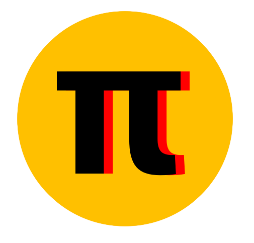
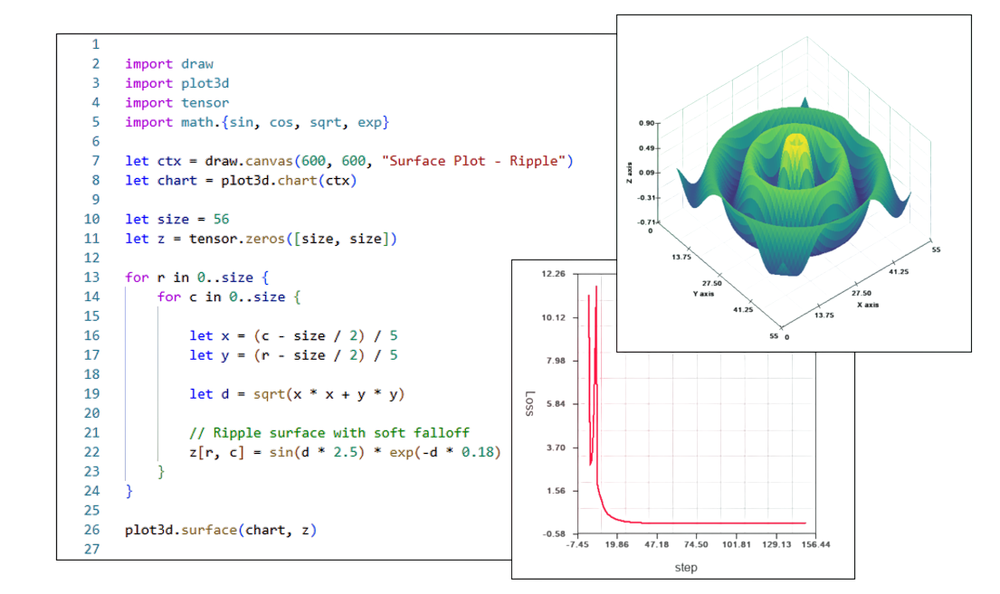
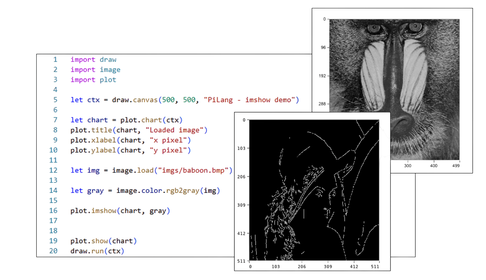

<p align="center">
  <a href="https://pi-lang.netlify.app/">
    
  </a>
</p>

<h1 align="center">Pilang</h1>

<p align="center">
  A compact language for turning data, math, and ideas into visible experiments.
</p>

<p align="center">
  <a href="https://pi-lang.netlify.app/"><strong>Visit the Pilang website</strong></a>
  |
  <a href="docs/README.md">Read the docs</a>
  |
  <a href="samples">Explore examples</a>
</p>

## Overview

Pilang is for the moment when an idea is still small enough to explore: shape
some data, transform it, run the math, and draw the result without assembling a
stack of packages first. It is a C-powered scripting language with tensors,
image processing, 2D charts, and interactive 3D plots in its core modules.

Its syntax keeps expressive operations close to the data. Build ranges and
comprehensions, slice in either direction, use `#` for length, spread values
with `...`, and send a value through a pipeline with `=>`. The result is a
language that reads naturally while staying playful and direct for numerical
work, simulations, and visual experiments.

## Math Plotting

Create mathematical plots and visualize data directly.

<p align="center">
  
</p>

## Image Processing

Apply image-processing operations such as edge detection and grayscale conversion.

<p align="center">
  
</p>


## The Pilang Feel

### A pipeline, not plumbing

Turn a collection into an answer as a readable sequence of operations. `=>`
passes the expression on its left into the next call; arrow functions and list
comprehensions make transformations compact without hiding the work.

```swift
let total = [n : n in 0..20] =>
    filter(n -> n % 2 == 0) =>
    map(n -> n ** 2) =>
    reduce((sum, n) -> sum + n, 0)

let highlighted = [n * n : n in 0..20 : n % 3 == 0]
```

### Collections with a visual vocabulary

Negative indexes, reverse slices, ranges, `#` length, destructuring, and spread
syntax are built into everyday expressions—not bolted on as library calls.

```swift
let trail = [2, 3, 5, 7, 11]
[first, second] = trail // first = 2, second = 3
let reversed = trail[::-1]
let extended = [0, ...trail, 13]

println(#extended) // 7
println(3 in trail) // true
```

### Math that reaches the screen

Tensors, statistics, drawing, plots, 3D visualization, and image operations
are available as native modules. Move from a matrix to a chart or surface plot
without first building an ecosystem around your script.

### Let domain objects speak the language

Objects can define `format`, `call`, indexing behavior, and `compute` hooks for
operators. A vector, unit, color, or symbolic value can participate in normal
Pilang expressions instead of living behind verbose method calls.

## Quick Taste

```swift
import math:m

fun area(radius) {
    return m.PI * radius ** 2
}

radii = [2, 4, 8]

for r in radii {
    println("radius = " + r + ", area = " + area(r))
}
```

## Language Tour

### Expressive Collections

```swift
scores = [91, 72, 88, 91, 64, 72]

unique = {91, 72, 88, 64}
curved = [min(score + 5, 100) : score in scores]
honors = []

for score in curved
    if score >= 90
        honors += score

println("unique scores: " + unique)
println("honors: " + honors)
println("top three-ish: " + curved[0:3])
```

### Functions and Closures

```swift
fun make_counter(start = 0) {
    let value = start

    return () -> {
        value += 1
        return value
    }
}

next_id = make_counter(100)
println(next_id()) // 101
println(next_id()) // 102
```

### Classes, Inheritance, and Callable Objects

```swift
class Shape {
    area() {
        return 0
    }

    perimeter() {
        return 0
    }
}

class Rectangle: Shape {
    constructor(width, height) {
        this.width = width
        this.height = height
    }

    area() {
        return this.width * this.height
    }

    perimeter() {
        return 2 * (this.width + this.height)
    }

    format() {
        return "Rectangle(" +
               this.width + ", " +
               this.height + ")"
    }
}

class Circle: Shape {
    constructor(radius) {
        this.radius = radius
    }

    area() {
        return 3.14159 * this.radius * this.radius
    }

    perimeter() {
        return 2 * 3.14159 * this.radius
    }

    format() {
        return "Circle(" + this.radius + ")"
    }
}

shapes = [
    Rectangle(10, 5),
    Circle(3)
]

for shape in shapes {
    println(shape)
    println("area = " + shape.area())
    println("perimeter = " + shape.perimeter())
    println("")
}
```

### Operator Hooks

Objects can participate in operators by defining compute methods, which makes domain objects feel native without changing the VM for every new type.

```swift
import lang

class Vec2 {
    constructor(x, y) {
        this.x = x
        this.y = y
    }

    compute(op, other) {
        if op == lang.OP_ADD
            return Vec2(this.x + other.x, this.y + other.y)
    }

    format() {
        return "Vec2(" + this.x + ", " + this.y + ")"
    }
}

println(Vec2(2, 3) + Vec2(4, 1))
```

### Tensors for Numerical Code

```swift
import tensor:t

x = t.from([[1, 2], [3, 4]])
w = t.eye(2, 2)

println(t.shape(x))
println(t.matmult(x, w))
println(t.mean(x))
```

### Plotting and Visualization

Pilang includes native SDL-backed drawing and plotting modules for quick visual feedback while experimenting with numerical code, simulations, and machine-learning examples. The `plot` module covers 2D charts such as loss curves, while `plot3d` supports interactive 3D surface, mesh, and wireframe plots.

```swift
import draw
import plot

let ctx = draw.canvas(480, 480, "Training Loss")
let chart = plot.chart(ctx)

plot.line(chart, steps, losses, draw.COLOR_RED)
plot.title(chart, "Training Loss")
plot.xlabel(chart, "step")
plot.ylabel(chart, "loss")
plot.grid(chart, true)

plot.show(chart)
draw.run(ctx)
```


## Run Pilang

From the repository root on Windows:

```powershell
pilang run test.pi
```

You can also use the shorthand form:

```powershell
pilang test.pi
```

### Build a `.px` project

Turn an entry script and its imported Pilang modules into a portable compiled
project file:

```powershell
pilang build app.pi
pilang app.px
```

This creates `app.px` beside `app.pi`. A `.px` contains Pilang bytecode and is
run by the Pilang runtime; it is not a standalone Windows `.exe`. When an
adjacent `.px` is valid, normal source execution uses it automatically and
rebuilds it when a source module changes. See the
[PX project format](docs/12.%20Advanced%20Topics/12.6-px-file-format.md) for
details.

Show available commands:

```powershell
pilang help
```

Developer helpers:

```powershell
pilang dis test.pi
pilang dis -o bytecode.txt test.pi
pilang fmt test.pi
pilang min test.pi
```

`fmt` and `min` rewrite the target file in place and use the JavaScript utilities in `utils/`, so Node.js and the formatter/minifier modules must be available.

## Build From Source

The repository includes a Makefile for native and browser builds. On Windows with MinGW available, use `make` from the repository root. Some MinGW installs expose this as `mingw32-make`.

```powershell
make release
```

Common targets:

- `make release`: build the optimized native executable, `release/pilang.exe`.
- `make debug`: build a debug native executable with `DEBUG_BUILD` enabled at `release/pilang.exe`.
- `make web`: build the Emscripten/WebAssembly output in `release/`.
- `make run`: build and run the native executable.
- `make test`: build the native executable and run `python tools/run_tests.py`.
- `make clean`: remove generated build outputs.

Run the end-to-end benchmark suite after a release build:

```powershell
python tools/run_benchmarks.py
```

See [`benchmark/README.md`](benchmark/README.md) for the included workloads and runner options.

The native build expects MinGW GCC and the SDL2 development libraries used by the project. The browser build expects Emscripten's `emcc`.

## Project Layout

- `pi_*.c`, `pi_*.h`: core compiler, parser, VM, values, objects, modules, and runtime internals.
- `builtin/`: built-in native modules.
- `libs/`: Pilang libraries written in `.pi`.
- `ML/`: numerical and machine-learning experiments written in Pilang.
- `release/`: local build outputs.
- `benchmark/`: end-to-end interpreter benchmark programs.
- `docs/`: language documentation and reference material.
- `tests/`: examples and regression tests grouped by language area.

## Documentation

Start with the [documentation index](docs/README.md), then explore:

- [Language features](docs/1.%20Introduction/1.2-features.md)
- [Running Pilang](docs/1.%20Introduction/1.4-running-pilang.md)
- [Data types](docs/3.%20Data%20Types/README.md)
- [Functions](docs/6.%20Functions/README.md)
- [Objects and classes](docs/7.%20Objects%20and%20Classes/README.md)
- [Modules](docs/8.%20Modules/README.md)
- [2D plotting](docs/8.%20Modules/8.4%20Built-in%20Modules/plot.md)
- [3D plotting](docs/8.%20Modules/8.4%20Built-in%20Modules/plot3d.md)
- [Image processing](docs/8.%20Modules/8.4%20Built-in%20Modules/image.md)
- [Examples](docs/13.%20Examples/README.md)

## Testing

Run the test suite with:

```bash
python tools/run_tests.py
```

Tests cover core language behavior, tensors, modules, object/class behavior, runtime types, built-ins, and larger example programs.

## Website

The language website and playground are available at:

**https://pi-lang.netlify.app/**

Use it to read docs, browse examples, and try Pilang in the browser.

## License

This project is licensed under the terms in [LICENSE](LICENSE).
