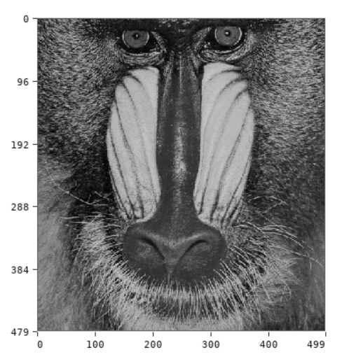

# image.color Module

The `image.color` module provides color-space conversion helpers for image
objects. Each function returns a new image.



```swift
import image
import image.color

let img = image.load("imgs/lenna.png")
let gray = image.color.rgb2gray(img)
image.show(gray, "Grayscale")
```

## Grayscale And RGB

### `image.color.rgb2gray(img)`

Converts an image to grayscale using luminance weights:

```text
gray = 0.299 * r + 0.587 * g + 0.114 * b
```

The result is stored as an RGB image with equal red, green, and blue channels.

### `image.color.gray2rgb(img)`

Copies a grayscale-style image into an RGB image representation.

### `image.color.gray2rgba(img)`

Converts a grayscale-style image to RGBA with alpha set to `255`.

## HSV

### `image.color.rgb2hsv(img)`

Converts RGB pixels to HSV and stores the result in RGB channels:

- red channel: hue mapped from `0..360` to `0..255`
- green channel: saturation mapped from `0..1` to `0..255`
- blue channel: value mapped from `0..1` to `0..255`
- alpha channel: `255`

```swift
let hsv = image.color.rgb2hsv(img)
```

### `image.color.hsv2rgb(img)`

Converts an HSV-encoded image, using the channel layout produced by
`rgb2hsv`, back to RGB.

```swift
let hsv = image.color.rgb2hsv(img)
let restored = image.color.hsv2rgb(hsv)
```

## Example

```swift
import image
import image.color

let img = image.load("imgs/baboon.bmp")
let gray = image.color.rgb2gray(img)
let rgba = image.color.gray2rgba(gray)

image.save(rgba, "gray_rgba.bmp")
```
