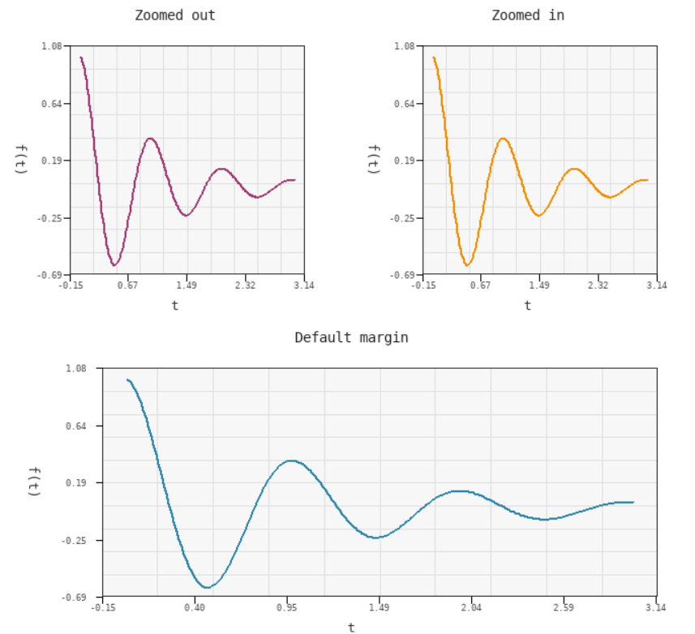
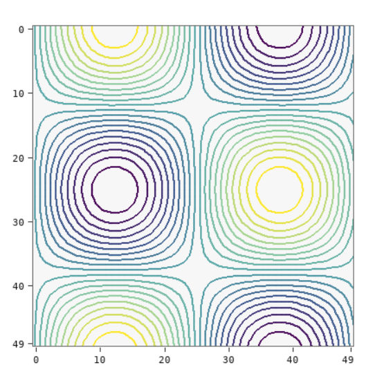

# plot Module

The `plot` module is Pilang's SDL-backed 2D plotting layer. It works with a
`draw` canvas and stores plot state in chart objects, so several charts can share
one window through subplots.



```swift
import draw
import plot

let ctx = draw.canvas(720, 480, "2D Plot")
let chart = plot.chart(ctx)

plot.line(chart, [0, 1, 2, 3], [0, 1, 4, 9])
plot.title(chart, "Quadratic")
plot.xlabel(chart, "x")
plot.ylabel(chart, "y")
plot.grid(chart, true)

plot.show(chart)
draw.run(ctx)
```

## Chart Lifecycle

### `plot.chart(ctx)`

Creates a chart attached to a `draw` context.

```swift
let ctx = draw.canvas(640, 480, "Chart")
let chart = plot.chart(ctx)
```

### `plot.show(chart)`

Renders the chart. When the chart belongs to a canvas, call `draw.run(ctx)` after
`plot.show(chart)` to keep the window open and allow redraws.

```swift
plot.show(chart)
draw.run(ctx)
```

## Series

### `plot.line(chart, x, y, color = auto)`

Adds a line series. `x` and `y` must be lists of numbers. `color` is an optional
integer RGB value, for example `0xff0000`.

```swift
plot.line(chart, [0, 1, 2], [1, 3, 2], 0x3366cc)
```

### `plot.scatter(chart, x, y, color = auto, shape = "circle")`

Adds a scatter series. The optional shape can be passed as the fourth argument
when no color is used, or as the fifth argument when a color is used.

```swift
plot.scatter(chart, [1, 2, 3], [2, 4, 3])
plot.scatter(chart, [1, 2, 3], [3, 1, 4], 0xdd3344, "square")
```

### `plot.bar(chart, labels, values, color = auto)`

Adds a bar chart. `labels` is normally a list of strings and `values` is a list
of numbers.

```swift
plot.bar(chart, ["A", "B", "C"], [12, 18, 9])
```

### `plot.hist(chart, values, bins = auto, color = auto)`

Adds a histogram from a list of numeric values.

```swift
plot.hist(chart, samples, 20)
```

### `plot.step(chart, x, y, color = auto)`

Adds a step plot, useful for piecewise-constant data.

```swift
plot.step(chart, [0, 1, 2, 3], [4, 4, 2, 5])
```

### `plot.func(chart, x_values, fun, color = auto)`

Evaluates a Pilang function for every value in `x_values` and plots the result
as a line series.

```swift
plot.func(chart, [-2, -1, 0, 1, 2], x -> x * x)
```

## Matrix And Image Plots

### `plot.imshow(chart, image_or_tensor)`

Displays an `image` object or tensor data inside chart axes. A 2D tensor is
drawn as a heatmap with tick labels and a color scale. A 3D tensor must have
shape `[height, width, channels]` with `channels` in `1..4`.

```swift
import image

let img = image.load("imgs/baboon.bmp")
plot.imshow(chart, img)
```

### `plot.heatmap(chart, tensor2d)`

Displays a 2D tensor as a heatmap.

```swift
let z = tensor.from([[1, 2, 3], [4, 5, 6]])
plot.heatmap(chart, z)
```

### `plot.contour(chart, tensor2d, levels = auto, color = auto)`

Draws contour lines over a 2D tensor. `levels` controls how many value bands are
sampled.



```swift
plot.contour(chart, z, 12, 0x222222)
```

## Vector Fields

### `plot.quiver(chart, x, y, u, v, color = auto)`

Draws arrows for a vector field. Use explicit coordinate lists:

```swift
plot.quiver(chart, xs, ys, us, vs, 0x444444)
```

or pass two 2D tensors for `u` and `v`:

```swift
plot.quiver(chart, u, v)
```

### `plot.streamplot(chart, x, y, u, v, color = auto)`

Uses the same accepted data layouts as `quiver`, but renders short connected
flow strokes instead of standalone arrows.

```swift
plot.streamplot(chart, xs, ys, us, vs)
```

## Labels And Display Options

### `plot.title(chart, text)`

Sets the chart title.

### `plot.xlabel(chart, text)`

Sets the x-axis label.

### `plot.ylabel(chart, text)`

Sets the y-axis label.

### `plot.grid(chart, enabled)`

Turns the grid on or off. `enabled` can be a boolean or a nonzero number.

### `plot.axes(chart, enabled)`

Turns axis lines on or off.

### `plot.tick(chart, enabled)`

Turns tick labels on or off.

### `plot.legend(chart, labels, x = auto, y = auto)`

Adds a legend. `labels` is a list of strings. Optional `x` and `y` place the
legend; omit them for automatic placement.

```swift
plot.legend(chart, ["train", "validation"])
plot.legend(chart, ["train", "validation"], 0.72, 0.12)
```

## Subplots

### `plot.subplot(chart, rows, cols, index)`

Places the chart in a subplot cell. `index` is 1-based and must be inside
`rows * cols`. Multiple chart objects can share the same canvas.

```swift
let ctx = draw.canvas(900, 500, "Subplots")

let left = plot.chart(ctx)
plot.subplot(left, 1, 2, 1)
plot.line(left, [0, 1, 2], [1, 4, 2])
plot.title(left, "Line")

let right = plot.chart(ctx)
plot.subplot(right, 1, 2, 2)
plot.bar(right, ["A", "B", "C"], [3, 6, 4])
plot.title(right, "Bars")

plot.show(left)
plot.show(right)
draw.run(ctx)
```

## Notes

- Chart functions mutate and return the chart, so calls can be grouped in any
  convenient order before `plot.show`.
- Colors are integer RGB values such as `0xff8800`.
- Tensor image plots expect `tensor` values from the `tensor` module.
