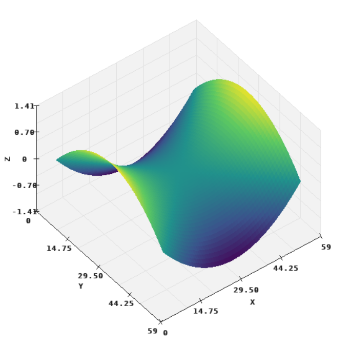
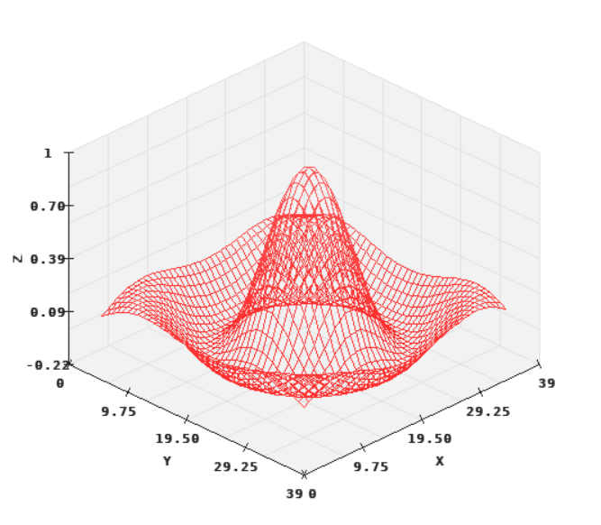
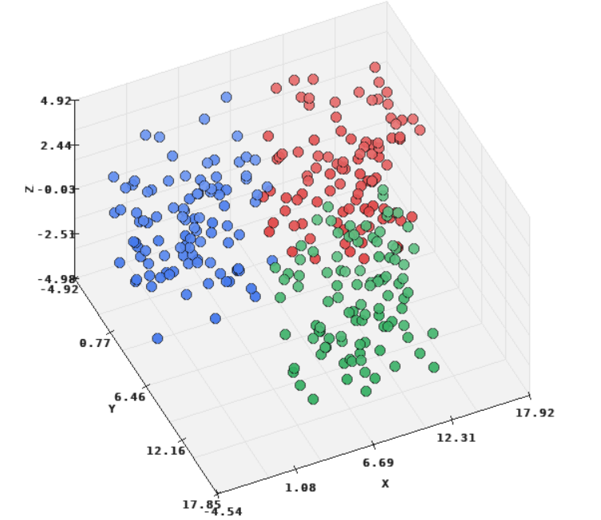

# plot3d Module

The `plot3d` module provides Pilang's native 3D visualization layer. It renders
surfaces, meshes, wireframes, and 3D scatter data into a `draw` canvas using a
stable orthographic camera.



```pilang
import draw
import plot3d
import tensor

let ctx = draw.canvas(700, 600, "3D Surface")
let chart = plot3d.chart(ctx)
let z = tensor.from([[0, 1, 0], [1, 2, 1], [0, 1, 0]])

plot3d.surface(chart, z)
plot3d.title(chart, "Surface")
plot3d.xlabel(chart, "x")
plot3d.ylabel(chart, "y")
plot3d.zlabel(chart, "z")

plot3d.show(chart)
draw.run(ctx)
```

## Chart Lifecycle

### `plot3d.chart(ctx)`

Creates a 3D chart attached to a `draw` context.

### `plot3d.show(chart)`

Renders the 3D chart. When using a canvas window, call `draw.run(ctx)` after
showing the chart.

## Series

### `plot3d.surface(chart, z, ...)`

Adds a filled 3D surface from a 2D tensor. The tensor row and column indexes form
the x/y grid and each tensor value is used as z height.


```pilang
plot3d.surface(chart, z)
```

### `plot3d.mesh(chart, z, ...)`

Adds a surface-like plot with mesh lines.

```pilang
plot3d.mesh(chart, z)
```

### `plot3d.wireframe(chart, z, ...)`

Adds a wireframe plot from a 2D tensor.



```pilang
plot3d.wireframe(chart, z)
```

### `plot3d.scatter(chart, x, y, z, ...)`

Adds 3D points from three numeric lists.



```pilang
plot3d.scatter(chart, xs, ys, zs)
```

You can also pass an `N x 3` tensor where each row is `[x, y, z]`.

```pilang
plot3d.scatter(chart, points)
```

Numeric arguments after the data are kept as rendering options by the chart.

## Labels And View

### `plot3d.title(chart, text)`

Sets the chart title.

### `plot3d.xlabel(chart, text)`

Sets the x-axis label.

### `plot3d.ylabel(chart, text)`

Sets the y-axis label.

### `plot3d.zlabel(chart, text)`

Sets the z-axis label.

### `plot3d.grid(chart, enabled)`

Turns the 3D grid on or off. `enabled` can be a boolean or nonzero number.

### `plot3d.view(chart, azimuth, elevation, distance = current)`

Changes the camera angles. `azimuth` rotates around the vertical axis,
`elevation` tilts the view, and optional `distance` adjusts camera distance.

```pilang
plot3d.view(chart, 45, 30)
plot3d.view(chart, 65, 22, 4)
```

## Subplots

### `plot3d.subplot(chart, rows, cols, index)`

Places a 3D chart in a subplot cell. `index` is 1-based.

```pilang
let ctx = draw.canvas(900, 480, "3D Subplots")

let a = plot3d.chart(ctx)
plot3d.subplot(a, 1, 2, 1)
plot3d.surface(a, z)
plot3d.title(a, "Surface")

let b = plot3d.chart(ctx)
plot3d.subplot(b, 1, 2, 2)
plot3d.wireframe(b, z)
plot3d.title(b, "Wireframe")

plot3d.show(a)
plot3d.show(b)
draw.run(ctx)
```

## Notes

- Surface-style plots require 2D tensors.
- Scatter plots accept either `x`, `y`, `z` lists or an `N x 3` tensor.
- 3D charts share the same canvas model as `plot`, so 2D and 3D visualization
  can be mixed in one program by using separate chart objects.
